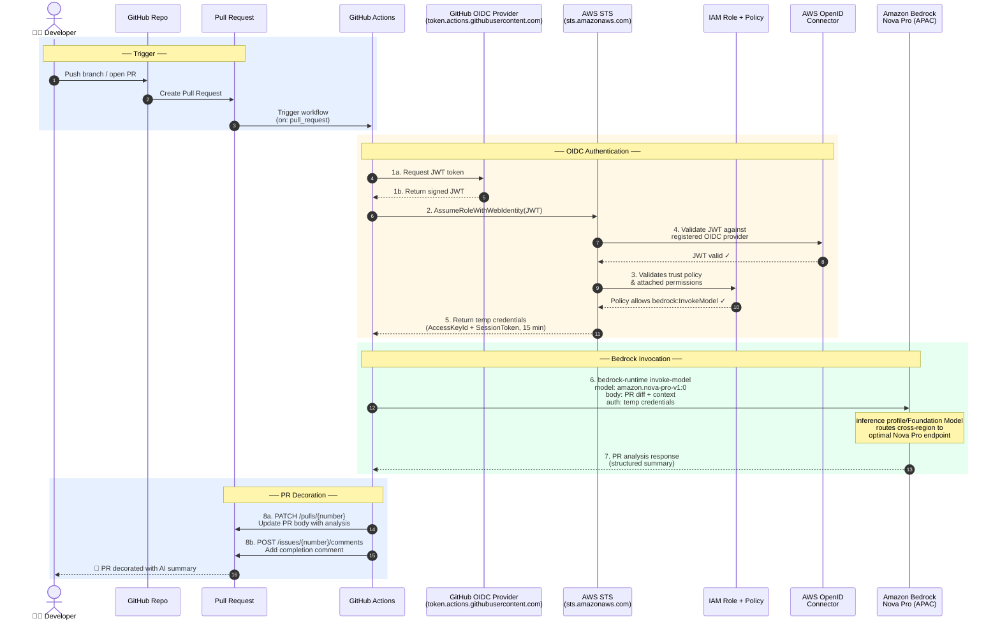
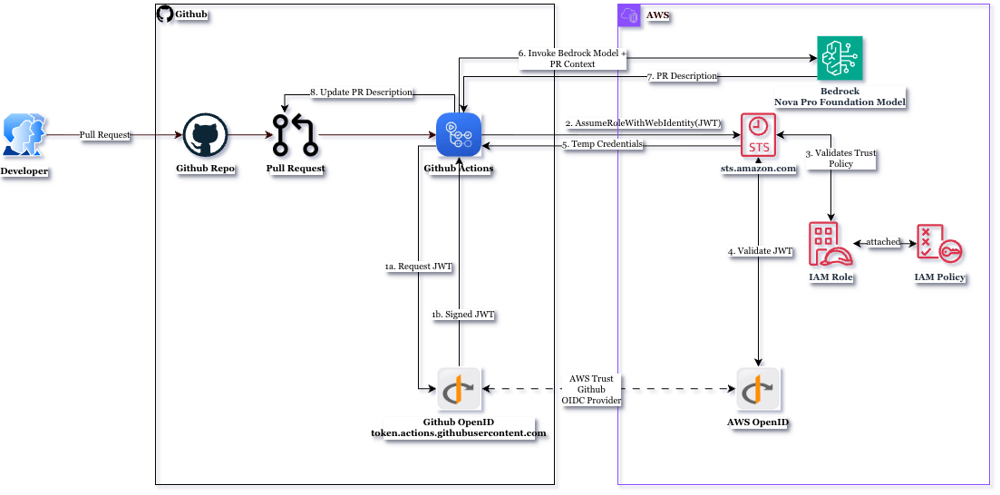

# PR Decorator

Automatically analyses and decorates pull requests using **Amazon Bedrock Nova Pro**. Triggered on every PR open, update, or reopen — no manual input needed.

---

## What it does

When a PR is opened or updated, the workflow:

1. Authenticates with AWS using OIDC (no stored access keys)
2. Calls Amazon Bedrock Nova Pro to analyse the PR diff
3. Updates the PR body with a structured summary
4. Posts a completion comment


## Sequence Diagram



---

## Architecture



## How authentication works

This setup uses **OpenID Connect (OIDC)**. GitHub generates a short-lived token per workflow run. AWS trusts that token and returns temporary credentials — no `AWS_ACCESS_KEY_ID` or `AWS_SECRET_ACCESS_KEY` stored anywhere.

---

## Prerequisites

- AWS account with Bedrock access enabled for **Amazon Nova Pro**
- Admin access to your GitHub repository
- AWS CLI installed locally (for setup commands)

---

## Step 1 — AWS setup

### 1a. Register GitHub as an identity provider

Run this once per AWS account:

```bash
aws iam create-open-id-connect-provider \
  --url https://token.actions.githubusercontent.com \
  --client-id-list sts.amazonaws.com
```

> **Note:** If you get `EntityAlreadyExists`, the provider is already registered — skip this step.

---

### 1b. Create the IAM trust policy

Create `trust-policy.json`:

```json
{
  "Version": "2012-10-17",
  "Statement": [{
    "Effect": "Allow",
    "Principal": {
      "Federated": "arn:aws:iam::<YOUR_ACCOUNT_ID>:oidc-provider/token.actions.githubusercontent.com"
    },
    "Action": "sts:AssumeRoleWithWebIdentity",
    "Condition": {
      "StringEquals": {
        "token.actions.githubusercontent.com:aud": "sts.amazonaws.com"
      },
      "StringLike": {
        "token.actions.githubusercontent.com:sub": "repo:{YOUR_GITHUB_USERNAME||YOUR_GITHUB_ORG}/YOUR_REPO_NAME:*"
      }
    }
  }]
}
```

Replace:

| Placeholder            | Replace with                           |
|------------------------|----------------------------------------|
| `YOUR_ACCOUNT_ID`      | Your 12-digit AWS account ID           |
| `YOUR_GITHUB_USERNAME` | Your GitHub username name              |
| `YOUR_GITHUB_ORG`      | Your GitHub org name                   |
| `YOUR_REPO_NAME`       | Exact repository name (case-sensitive) |


---

### 1c. Create the IAM role

```bash
aws iam create-role \
  --role-name pr-decorator-bedrock-role \
  --assume-role-policy-document file://trust-policy.json \
  --description "Role for GitHub Actions PR Decorator"
```

---

### 1d. Create and attach the Bedrock access policy

Create `bedrock-policy.json`:

```json
{
    "Version": "2012-10-17",
    "Statement": [
        {
            "Sid": "AllowNovaModelsApSouth1Only",
            "Effect": "Allow",
            "Action": [
                "bedrock:InvokeModel"
            ],
            "Resource": [
                "arn:aws:bedrock:::foundation-model/amazon.nova-lite-v1:0",
                "arn:aws:bedrock:::foundation-model/amazon.nova-pro-v1:0",
                "arn:aws:bedrock::<YOUR_ACCOUNT_ID>:inference-profile/apac.amazon.nova-pro-v1:0",
                "arn:aws:bedrock::<YOUR_ACCOUNT_ID>:inference-profile/apac.amazon.nova-lite-v1:0"
            ]
        }
    ]
}
```

Attach it:

```bash
aws iam create-policy \
  --policy-name BedrockProfilePolicy \
  --policy-document file://bedrock-policy.json

aws iam attach-role-policy \
  --role-name pr-decorator-bedrock-role \
  --policy-arn arn:aws:iam::<YOUR_ACCOUNT_ID>:policy/BedrockProfilePolicy
```

---

### 1e. Enable Nova Pro model access

1. Go to the [Amazon Bedrock console](https://console.aws.amazon.com/bedrock)
2. Click **Model access** in the left navigation
3. Find **Amazon Nova Pro** and click **Request access**
4. Wait for approval (usually instant)

---

## Step 2 — GitHub setup

### 2a. Add repository secret

Go to **Settings → Secrets and variables → Actions → New repository secret**:

| Secret name        | Value                                                           |
|--------------------|-----------------------------------------------------------------|
| `AWS_IAM_ROLE_ARN` | `arn:aws:iam::<YOUR_ACCOUNT_ID>:role/pr-decorator-bedrock-role` |

### 2b. Add repository variables

On the same page, click the **Variables** tab:

i.e apac preferred region set 

| Variable name          | Value                       |
|------------------------|-----------------------------|
| `AWS_REGION`           | `ap-south-1`                |
| `AWS_BEDROCK_MODEL_ID` | `apac.amazon.nova-pro-v1:0` |

### 2c. Add the workflow file

Create `.github/workflows/pr-decorator.yml`:

```yaml
name: PR Decorator (Automatic)

on:
  pull_request:
    types: [opened, synchronize, reopened]
    branches:
      - main

permissions:
  contents: read
  pull-requests: write
  id-token: write   # required for OIDC

jobs:
  decorate-pr:
    runs-on: ubuntu-latest
    # Block fork PRs — they cannot access secrets
    if: github.event.pull_request.head.repo.full_name == github.repository

    steps:
      - name: Checkout code
        uses: actions/checkout@v6
        with:
          fetch-depth: 0

      - name: Configure AWS credentials
        uses: aws-actions/configure-aws-credentials@v6
        with:
          role-to-assume: ${{ secrets.AWS_IAM_ROLE_ARN }}
          role-session-name: GitHubActions-AutoPRDecorator
          aws-region: ${{ vars.AWS_REGION }}

      # ubuntu-latest ships with CLI v1 which lacks bedrock-runtime
      - name: Upgrade AWS CLI
        run: |
          curl -s https://awscli.amazonaws.com/awscli-exe-linux-x86_64.zip -o awscliv2.zip
          unzip -q awscliv2.zip
          sudo ./aws/install --update

      - name: Test Bedrock access
        run: |
          aws bedrock-runtime invoke-model \
            --model-id ${{ vars.AWS_BEDROCK_MODEL_ID }} \
            --body '{"messages":[{"role":"user","content":[{"text":"ping"}]}]}' \
            --region ${{ vars.AWS_REGION }} \
            --cli-binary-format raw-in-base64-out \
            test-response.json
          echo "Bedrock access confirmed"

      - name: Run PR decorator
        uses: ./
        with:
          pr-decorator-version: source
          pr-number: ${{ github.event.pull_request.number }}
          base-sha: ${{ github.event.pull_request.base.sha }}
          head-sha: ${{ github.event.pull_request.head.sha }}
          head-ref: ${{ github.event.pull_request.head.ref }}
          aws-region: ${{ vars.AWS_REGION }}
          region: ${{ vars.AWS_REGION }}
          mode: "body"
          overwrite: "false"

      - name: Add completion comment (optional)
        uses: actions/github-script@v9
        with:
          script: |
            github.rest.issues.createComment({
              issue_number: ${{ github.event.pull_request.number }},
              owner: context.repo.owner,
              repo: context.repo.repo,
              body: '🤖 **PR Decorator Complete**\n\nAnalysed using AWS Bedrock Nova Pro (APAC).\n\n_Triggered by: ${{ github.event_name }} on ${{ github.event.pull_request.head.ref }}_'
            })
```

---

## Step 3 — Verify

Create a test PR to trigger the workflow:

```bash
git checkout -b test/bedrock-setup
echo "test" >> README.md
git add README.md
git commit -m "test: trigger PR decorator"
git push origin test/bedrock-setup
```

Open a PR targeting `main`. In the **Actions** tab, a successful run shows all steps green, the PR body updated, and a completion comment posted.

---

## Troubleshooting

| Error                                                     | Cause                                                           | Fix                                                                                                                |
|-----------------------------------------------------------|-----------------------------------------------------------------|--------------------------------------------------------------------------------------------------------------------|
| `Not authorized to perform sts:AssumeRoleWithWebIdentity` | Trust policy `sub` condition mismatch, or OIDC provider missing | Verify provider exists: `aws iam list-open-id-connect-providers`. Check repo name in trust policy matches exactly. |
| `Found invalid choice 'invoke-model' under bedrock`       | Wrong CLI namespace                                             | Use `aws bedrock-runtime invoke-model`, not `aws bedrock invoke-model`                                             |
| `AccessDenied` on `bedrock:InvokeModel`                   | Policy not attached, or wrong resource ARN                      | Run `aws iam list-attached-role-policies --role-name pr-decorator-bedrock-role`                                    |
| Model access denied                                       | Nova Pro not enabled                                            | Go to Bedrock console → Model access → enable Amazon Nova Pro                                                      |

### Verify your setup

```bash
# Check OIDC provider exists
aws iam list-open-id-connect-providers

# Check trust policy
aws iam get-role \
  --role-name pr-decorator-bedrock-role \
  --query Role.AssumeRolePolicyDocument

# Check attached policies
aws iam list-attached-role-policies \
  --role-name pr-decorator-bedrock-role

# Test Bedrock directly
aws bedrock-runtime invoke-model \
  --model-id apac.amazon.nova-pro-v1:0 \
  --body '{"messages":[{"role":"user","content":[{"text":"hello"}]}]}' \
  --region ap-south-1 \
  --cli-binary-format raw-in-base64-out \
  response.json && cat response.json
```

---

## Security notes

- Fork PRs are blocked — the `if:` condition prevents forks from accessing secrets
- OIDC tokens are short-lived (15 min) and scoped to a single workflow run
- The IAM role is limited to `bedrock:InvokeModel` only — no broader AWS access
- The trust policy `sub` condition locks the role to this specific repository